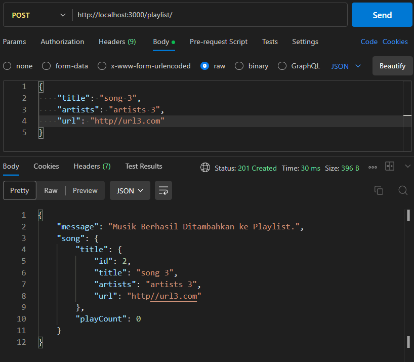
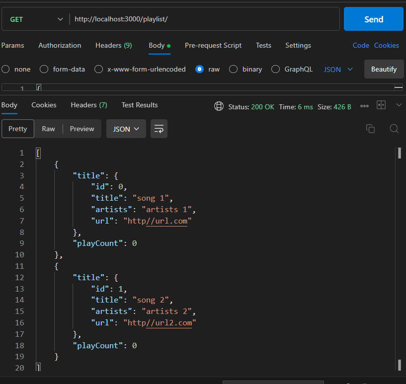
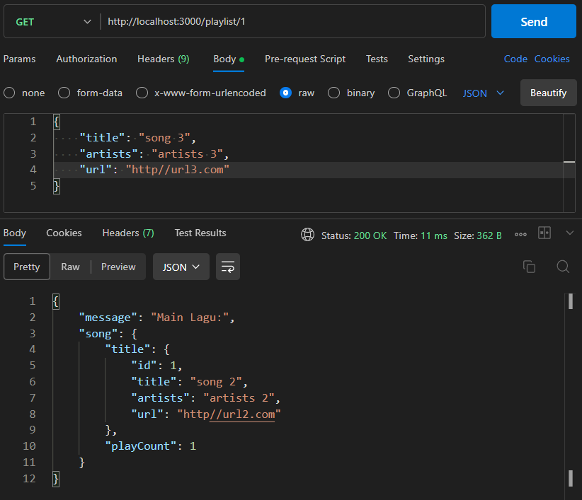

# Homework module 2.3
 1. Make playlist as a model 
 (Attributes: Title, Artists (can have multiple)) 
 
 2. Add song to your playlist 

 3. Get List of songs from your playlist
 
 
 4. Play song from your playlist 
 
 
 5. Track song play count in the playlist 
 
 6. Add feature to Get list of songs to be sorted by most played 
